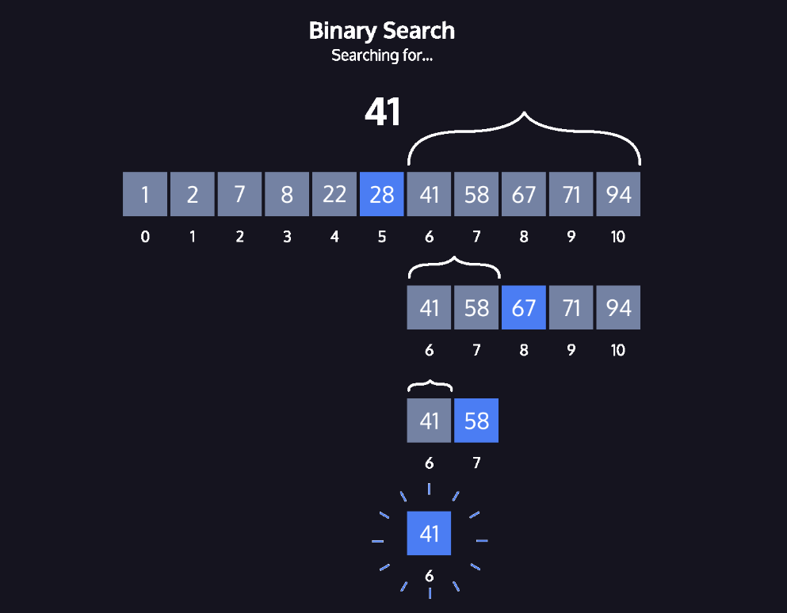

# Binary Search

Binary search requires a sorted data-set. We then take the following steps:

1. **Check the middle value of the dataset**.
    - If this value matches our target we can return the index.
2. If the middle value is **less than our target**
    - Start at step 1 using the **right half** of the list.
3. If the middle value is **greater than our target**
    - Start at step 1 using the **left half** of the list.

