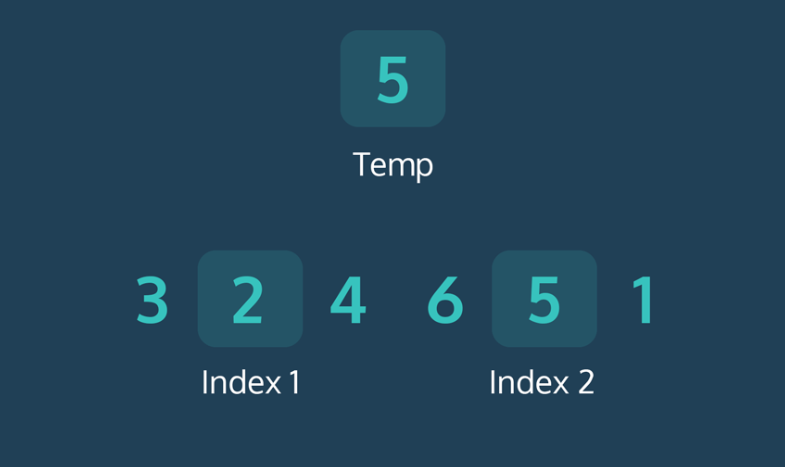

# Bubble Sort

Bubble sort is an introductory sorting algorithm that iterates through a list and compares pairings of adjacent elements.

The bubble sort algorithm takes an array of elements and reorders the elements of the input from smallest to largest. To achieve this, bubble sort works by comparing a pair of neighboring elements and swapping their positions in the array so that the larger of the two elements is always on the right. Doing this continuously results in the largest element “bubbling” up to the end of the array, giving this sort its name. The algorithm only stops when there are no more values that need to be swapped.

