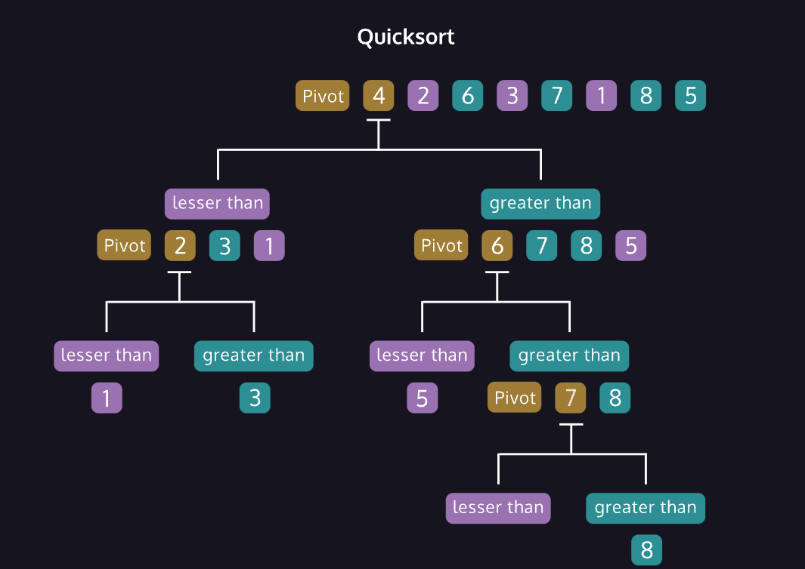

# Quick Sort

Quicksort is an efficient recursive algorithm for sorting arrays or lists of values. The algorithm is a *comparison* sort, where values are ordered by a comparison operation such as `>` or `<`.

Quicksort uses a *divide and conquer* strategy, breaking the problem into smaller sub-problems until the solution is so clear there’s nothing to solve.

We choose a single *pivot* element from the list. Every other element is compared with the pivot, which *partitions* the array into three groups.

1. A sub-array of elements **smaller than** the pivot.
2. The pivot itself.
3. A sub-array of elements **greater than** the pivot.

The process is repeated on the sub-arrays until they contain zero or one element.

The graphic displays two data sets which always use the *first* element as the pivot. Notice how many more steps are required when the quicksort algorithm is run on an already sorted input. The partition step of the algorithm hardly divides the array at all!

The worst case occurs when we have an imbalanced partition like when the first element is continually chosen in a sorted data-set.

One popular strategy is to select a random element as the pivot for each step. The benefit is that *no particular data set* can be chosen ahead of time to make the algorithm perform poorly.

Another popular strategy is to take the first, middle, and last elements of the array and choose the median element as the pivot. The benefit is that the division of the array tends to be more uniform.

Quicksort is an unusual algorithm in that the worst case runtime is `O(N^2)`, but the average case is `O(N * logN)`.

We typically only discuss the worst case when talking about an algorithm’s runtime, but for Quicksort it’s so uncommon that we generally refer to it as `O(N * logN)`.

