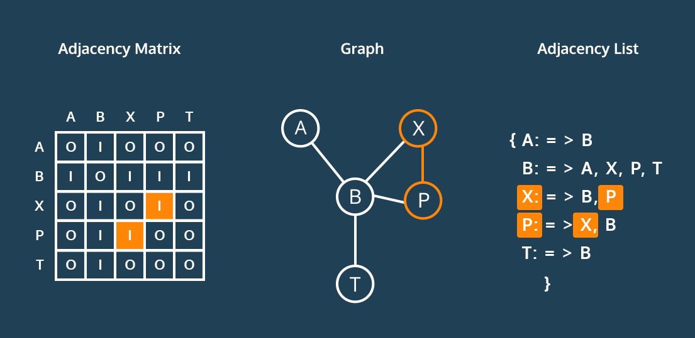

# Graphs

Graphs are the perfect data structure for modeling networks, which make them an indispensable piece of your data structure toolkit. They’re composed of nodes, or vertices
, which hold data, and edges, which are a connection between two vertices. A single node is a vertex.

This is a weighted graph, where edges have a number or cost associated with traveling between the vertices. When tallying the cost of a path, we add up the total cost of the edges used.

Directed graph, where edges restrict the direction of movement between vertices.

We typically represent the vertex-edge relationship of a graph in two ways: an adjacency list or an adjacency matrix.

An adjacency matrix is a table. Across the top, every vertex in the graph appears as a column. Down the side, every vertex appears again as a row. Edges can be bi-directional, so each vertex is listed twice.

In an adjacency list, each vertex contains a list of the vertices where an edge exists. To find an edge, one looks through the list for the desired vertex.

We’ll take an object-oriented approach to build an implementation of the graph data structure in JavaScript. With three classes, `Edge`, `Vertex`, and `Graph`, we can implement a variety of graphs that satisfy the requirements of many algorithms.

we will create our `Graph` with the following requirements:

- A `Vertex` can store any data.
- A `Vertex` maintains a list of connections to other vertices, represented by a list of `Edge` instances.
- A `Vertex` can add and remove edges going to another `Vertex`.
- A `Graph` stores all of its vertices, represented by a list of `Vertex` instances.
- A `Graph` knows if it is directed or undirected.
- A `Graph` knows if it is weighted or unweighted.
- A `Graph` can add and remove its own vertices.
- A `Graph` can add and remove edges between stored vertices.