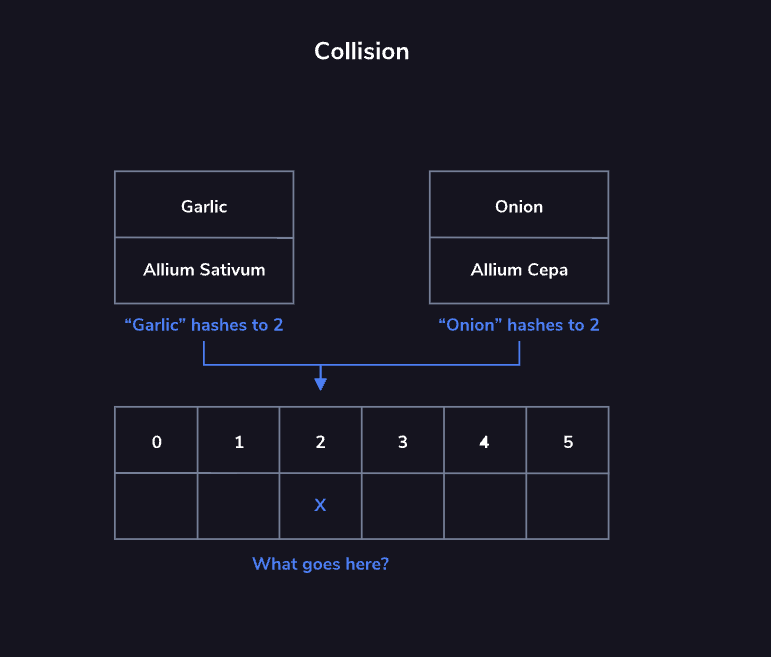

# HashMap

Hash maps are data structures that serve as efficient key-value stores. They are capable of assigning and retrieving data in the fastest way possible. This is because the underlying data structure that hash maps use is an array.

A value is stored at an array index determined by plugging the key into a hash function. Because we always know exactly where to find values in a hash map, we have constant access to any of the values it contains.

This quick access to values makes a hash map a good choice of data structure whenever we need to store a lot of values but need fast look-up time.

The *hashing function* is the secret to efficiently storing and retrieving values in a hash map. A hashing function takes a key as input and returns an index within the hash map’s underlying array.

This function is said to be *deterministic*. That means the hashing function must always return the same index when given the same key. This is important because we will need to hash the key again later to retrieve the stored value. We won’t be able to do this unless our hashing function behaves in a predictable and consistent way.

