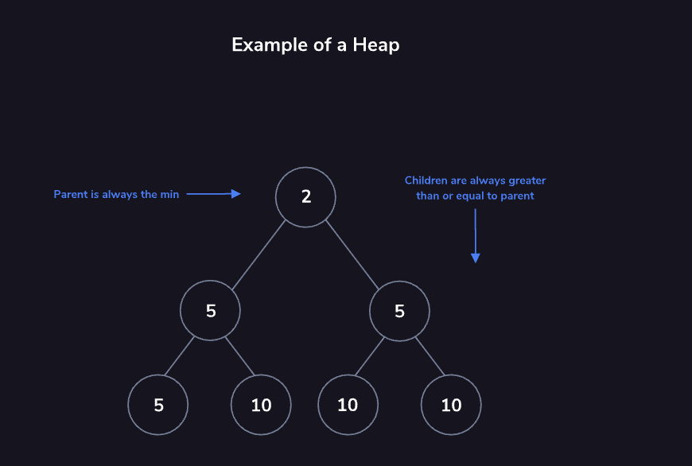

# Heaps

Heaps tracking the maximum or minimum value are *max-heaps* or *min-heaps*. We will focus on min-heaps, but the concepts for a max-heap are nearly identical.

Think of the min-heap as a binary tree with two qualities:

- The root is the **minimum value** of the dataset.
- Every child’s value is **greater than or equal to its parent**.

