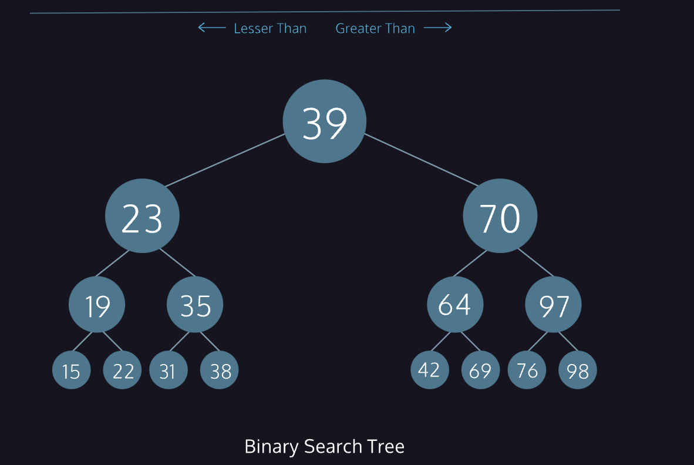

# Tree

Trees are an essential data structure for storing hierarchical data with a directed flow.

Similar to linked lists and graphs, trees are composed of nodes which hold data. The diagram represents nodes as rectangles and data as text.

Nodes also store references to zero or more **other tree nodes**. Data moves **down** from node to node. We depict those references as lines drawn between rectangles.

Trees are often displayed with a single node at the top and connected nodes branching downwards.

A *binary tree* is a type of tree where each parent can have **no more than two children**, known as the *left child* and *right child*.

Further constraints make a *binary search tree*:

- Left child values must be lesser than their parent.
- Right child values must be greater than their parent.

The constraints of a binary search tree allow us to search the tree efficiently. At each node, we can discard **half** of the remaining possible values!

