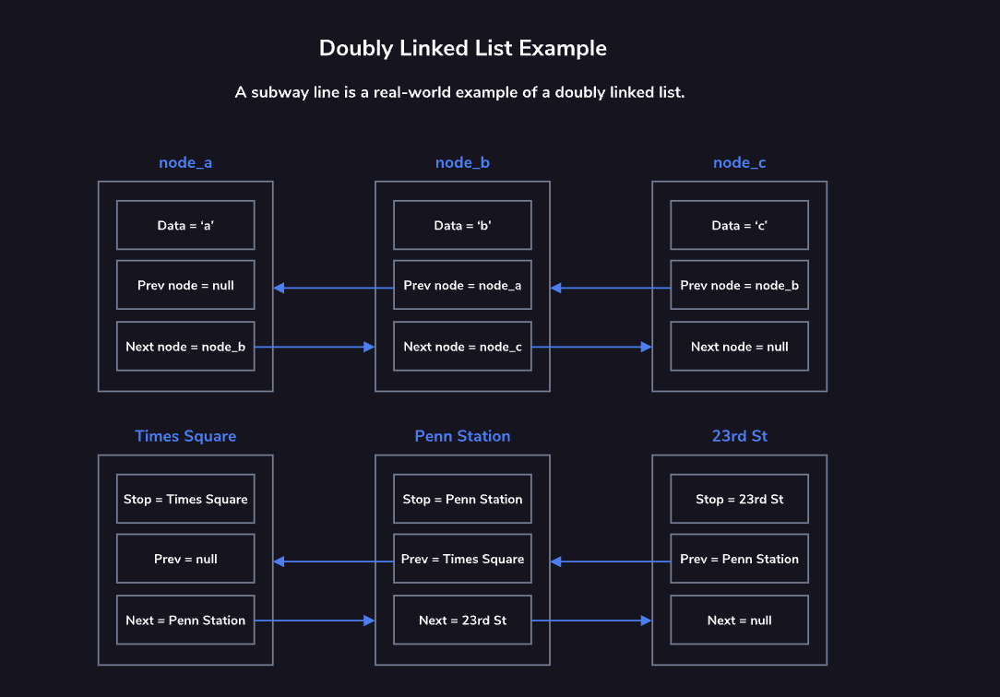

# Doubly Linked Lists

Like a singly linked list, a doubly linked list is comprised of a series of nodes. Each node contains data and two links (or pointers) to the next and previous nodes in the list. The head node is the node at the beginning of the list, and the tail node is the node at the end of the list. The head node’s previous pointer is set to null and the tail node’s next pointer is set to null.

