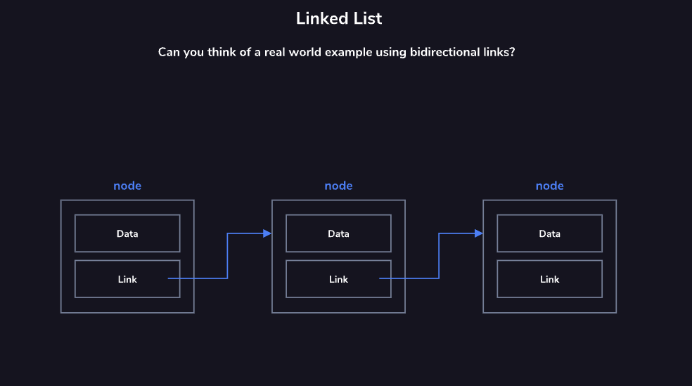

# Linked List

The list is comprised of a series of nodes as shown in the diagram. The head node is the node at the beginning of the list. Each node contains data and a link (or pointer) to the next node in the list. The list is terminated when a node’s link is null. This is called the tail node.

Since the nodes use links to denote the next node in the sequence, the nodes are not required to be sequentially located in memory. These links also allow for quick insertion and removal of nodes.

Linked lists typically contain unidirectional links (next node), but some implementations make use of bidirectional links.

