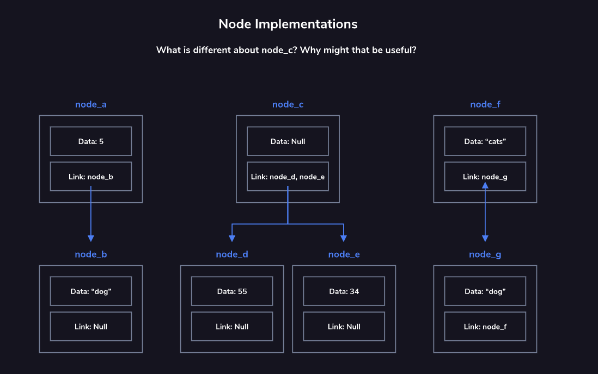

# Nodes

Nodes are the fundamental building blocks of many computer science data structures. They form the basis for linked lists, stacks, queues, trees, and more.

An individual node contains data and links to other nodes. Each data structure adds additional constraints or behavior to these features to create the desired structure.

The link or links within the node are sometimes referred to as *pointers*. This is because they “point” to another node.

Typically, data structures implement nodes with one or more links. If these links are `null`, it denotes that you have reached the end of the particular node or link path you were previously following.

If you inadvertently remove the single link to a node, that node’s data and any linked nodes could be “lost” to your application. When this happens to a node, it is called an orphaned node.

