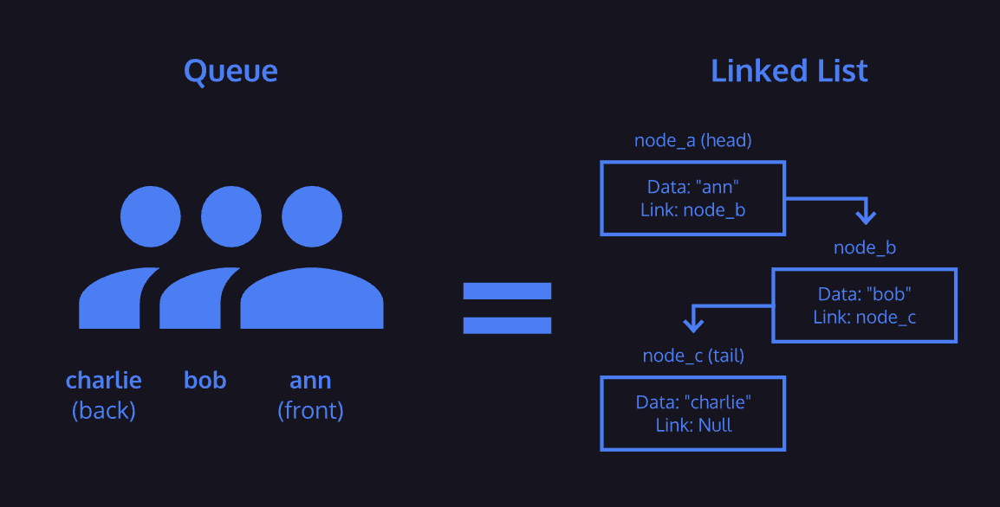

# Queue

A queue is a data structure which contains an ordered set of data.

Queues provide three methods for interaction:

- Enqueue - adds data to the “back” or end of the queue
- Dequeue - provides and removes data from the “front” or beginning of the queue
- Peek - reveals data from the “front” of the queue without removing it

Queues are a First In, First Out or FIFO structure.

Queues can be implemented using a linked list as the underlying data structure. The front of the queue is equivalent to the head node of a linked list and the back of the queue is equivalent to the tail node.

Similar to stacks, attempting to enqueue data onto an already full queue will result in a queue overflow. If you attempt to dequeue data from an empty queue, it will result in a queue underflow.

Some queues require limits on the number of nodes they can have, while other queues don’t. Queues that restrict the number of elements they can store are called bounded queues.

