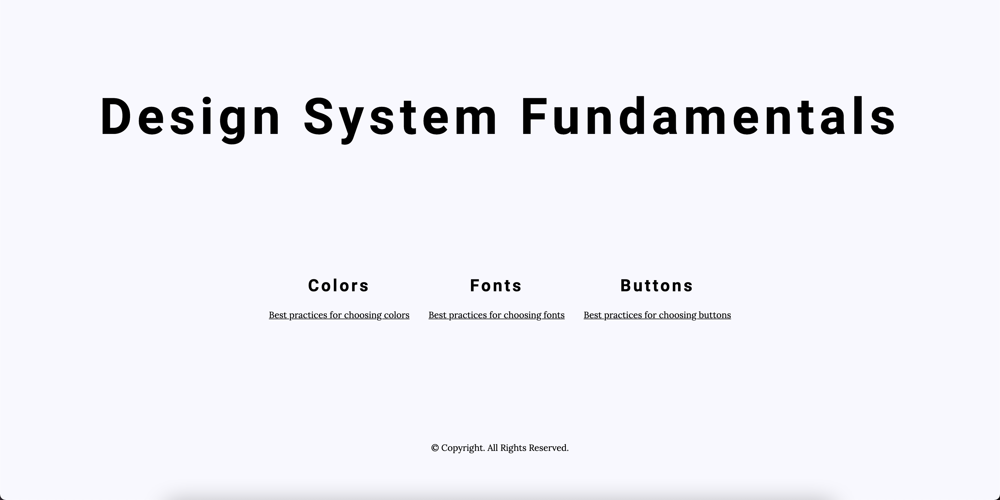
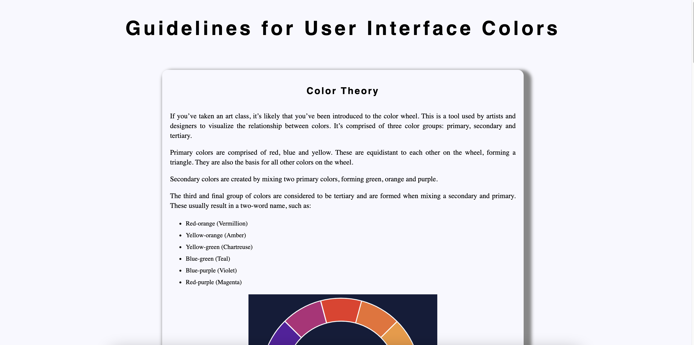
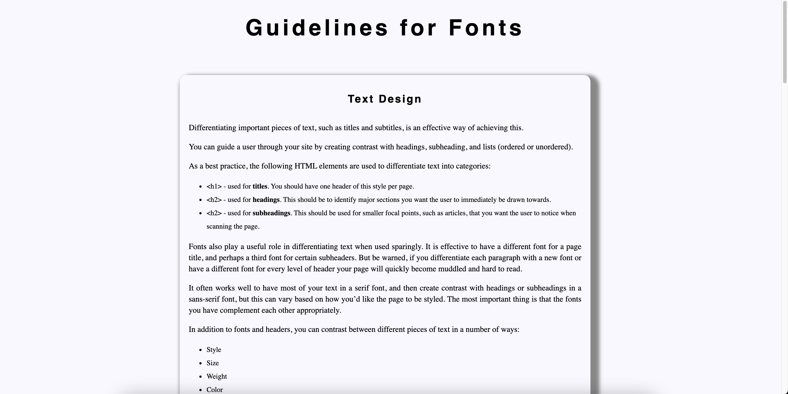
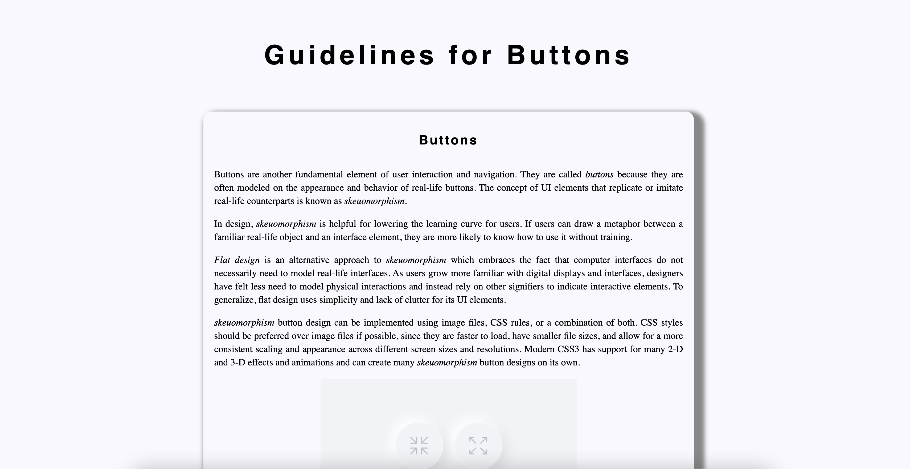

# My Website Design System

## Description:
In this project, you’ll build a style guide/design system for your website. 
Developers and designers use design systems in order to organize the look and feel of a website 
or web application. 

Design systems help to document the visual vocabulary and reusable components 
of a large website. As your websites grow larger and more complex, having a consistent set of styles 
will help them stay cohesive and enjoyable for users! It also helps as you start working with other
developers, as you can have a consistent reference for how your website should be built.

Your style guide/design system will include at least a section on colors, fonts, and specific text styles.

## Screenshots of My Design System Webpage:
### Main Webpage

### Colors Webpage

### Fonts Webpage

### Buttons Webpage
