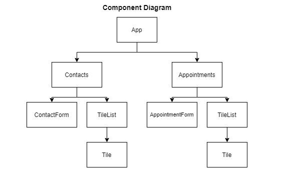

# Appointment Planner

**Description:** In this project, you will use functional React components to create an app that manages contacts and appointments. The app consists of two pages: one to view and add contacts and one to view and add appointments.

